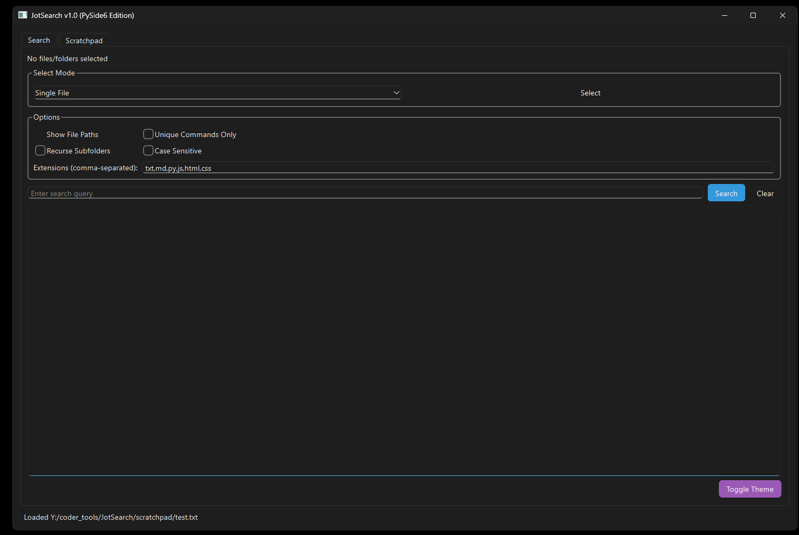
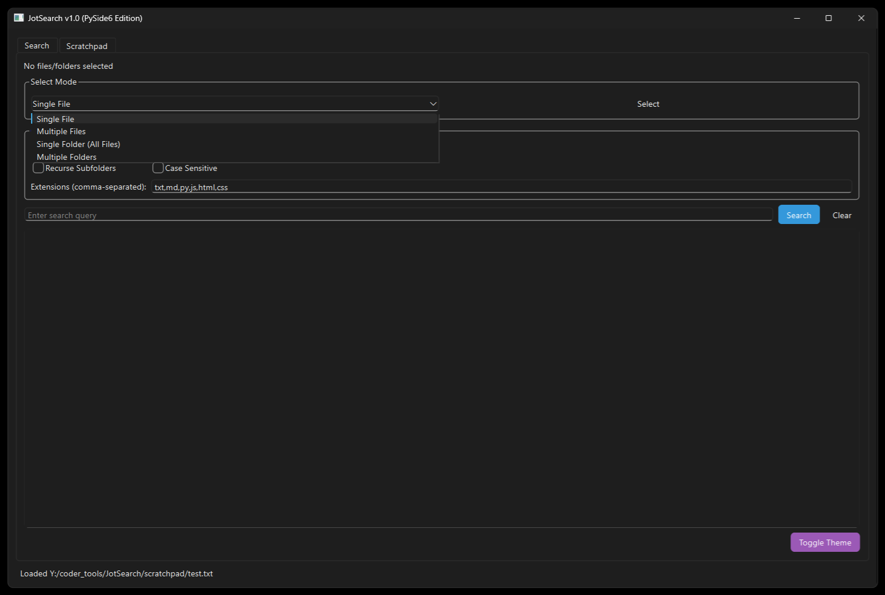
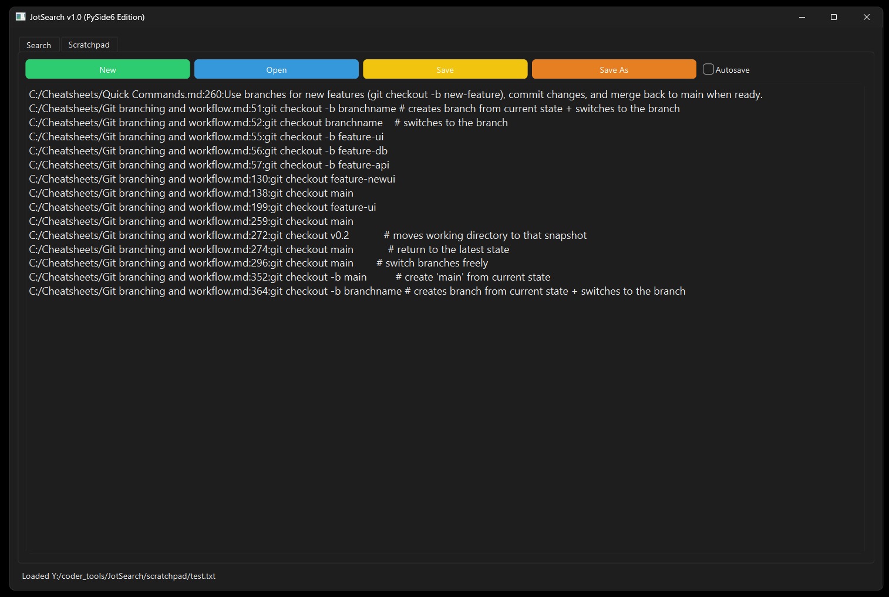
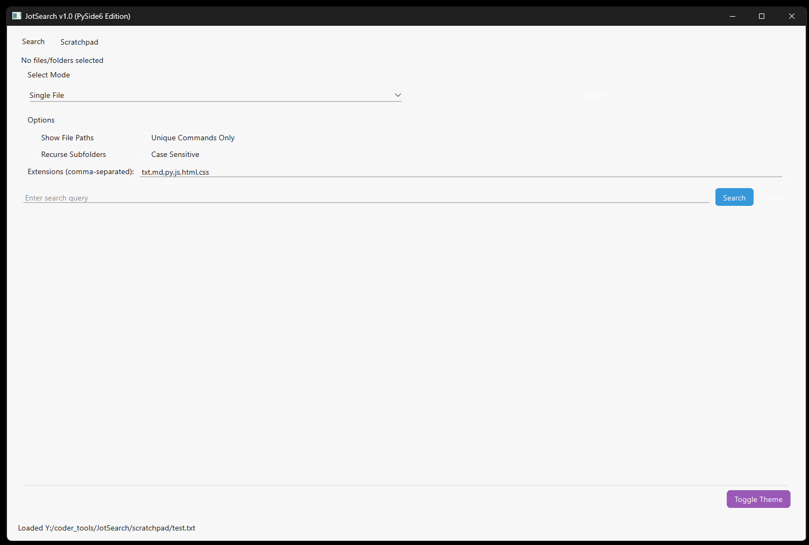

# 🧠 JotSearch v2.0 (PySide6 Edition)

A modern, tabbed desktop search utility built in **Python (PySide6)** that integrates **Ripgrep (rg)** for ultra-fast file content searches.  
Designed with a professional, dark-themed UI, multi-folder support, and an integrated scratchpad for quick note-taking.
---

## ✨ Features

### 🔍 **Search Tab**
- **Modes:**
  - Single File
  - Multiple Files
  - Single Folder
  - Multiple Folders
- **Options:**
  - Show/Hide File Paths
  - Filter Unique Commands
  - Recurse Subfolders (configurable per mode)
  - Case Sensitivity Toggle
  - Extension filter (`txt,md,py,js,html,css` by default)
- **Results Display:**
  - Clean format:  
    ```
    file_path:line:result
    ```
  - Optional hiding of file paths.
  - Commands always shown on new lines.
- **Controls:**
  - Press **Enter** to start a search.
  - **Clear** button to reset results.
  - Real-time display of selected folders/files.
---

### ✍️ **Scratchpad Tab**
- Lightweight text editor for notes or command snippets.
- Buttons:  
  🟢 `New` 🔵 `Open` 🟡 `Save` 🟠 `Save As`  
  ✅ `Autosave` (2s delay after last keystroke)
- Autosave feedback in the status bar.
---

### 🎨 **Appearance**
- **Dark Mode (default)** and **Light Mode** toggle.
- **BGYOR button palette** for visual clarity:
  | Action | Color | Hex |
  |--------|--------|------|
  | Search | Blue | `#3498db` |
  | New | Green | `#2ecc71` |
  | Save | Yellow | `#f1c40f` |
  | Save As | Orange | `#e67e22` |
  | Theme Toggle | Violet | `#9b59b6` |
  | Exit/Warnings | Red | `#e74c3c` |
---

## ⚙️ Installation

### **Requirements**
- Python ≥ 3.9
- Dependencies:
```bash
  pip install PySide6 requests
```  

Optional (for developers):
```bash
pip install pyinstaller
```

🚀 Running the App
Run directly:
```bash
python JotSearch.py
```
Or create a packaged executable (Windows example):
```bash
pyinstaller --noconsole --onefile JotSearch.py
```

⚡ Ripgrep Integration
About Ripgrep
JotSearch uses Ripgrep (rg) — a blazing-fast text search engine written in Rust.
If Ripgrep is not installed, JotSearch will automatically download a portable binary suitable for your OS.

Where it’s stored
Downloaded binaries are saved in:
<app_folder>/bin/rg(.exe)

Manual Setup (optional)
If automatic installation fails, you can manually install rg:

Windows
Download the ZIP from:
https://github.com/BurntSushi/ripgrep/releases/latest
Extract rg.exe to:
JotSearch/bin/

macOS / Linux
Use your package manager:
brew install ripgrep
# or
sudo apt install ripgrep

📄 License Information
JotSearch License (MIT)
MIT License

Ripgrep License (MIT / Unlicense)
Ripgrep is developed by Andrew Gallant and licensed under either:

The MIT License, or
The Unlicense (public domain).

For more details, visit:
https://github.com/BurntSushi/ripgrep

📁 Project Structure
JotSearch/
├── JotSearch.py           # Main PySide6 GUI
├── README.md              # Documentation (this file)
├── screenshots/screenshot.png
├── scratchpad/custom files
├── bin/
│   └── rg(.exe)           # Ripgrep binary (auto-downloaded)
└── requirements.txt       # Optional dependency list

🧪 Debug & Development
To enable debug printouts (for testing):
Add print() statements in key methods: run_search, autosave_now, pick_target.
All GUI updates are safe to trigger from within main thread (Qt event loop safe).

🧰 Credits
Ripgrep by Andrew Gallant (BurntSushi)
PySide6 by The Qt Company
Concept & development: drem666

“Fast. Focused. Functional. — JotSearch brings Ripgrep power into a beautiful desktop interface.”