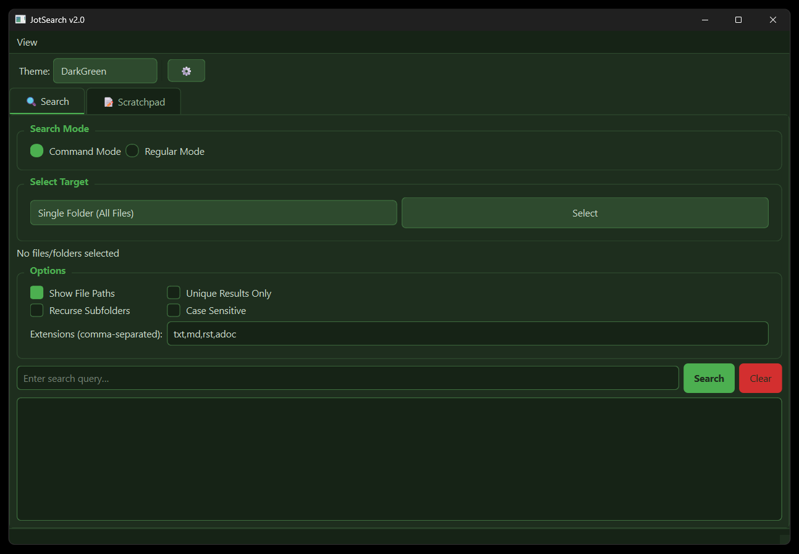
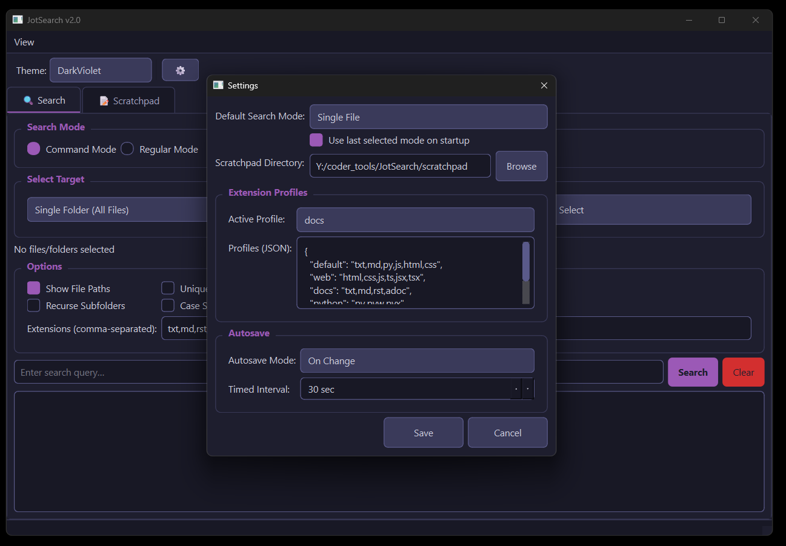
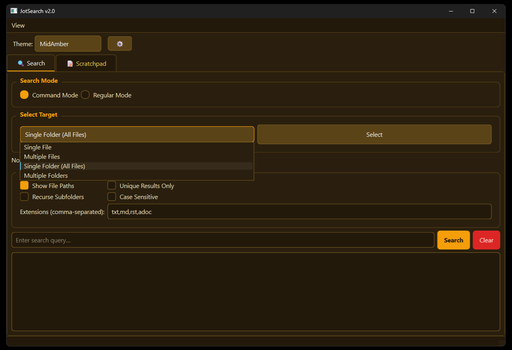
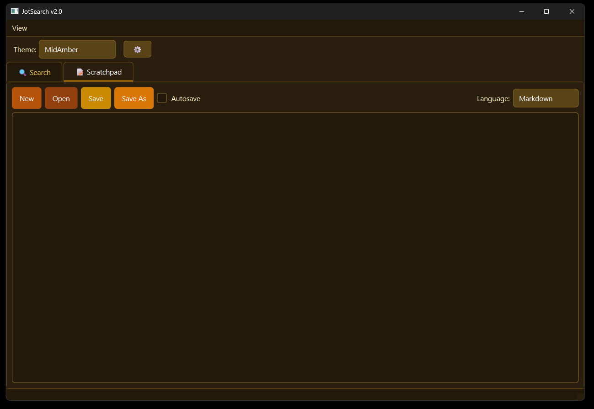
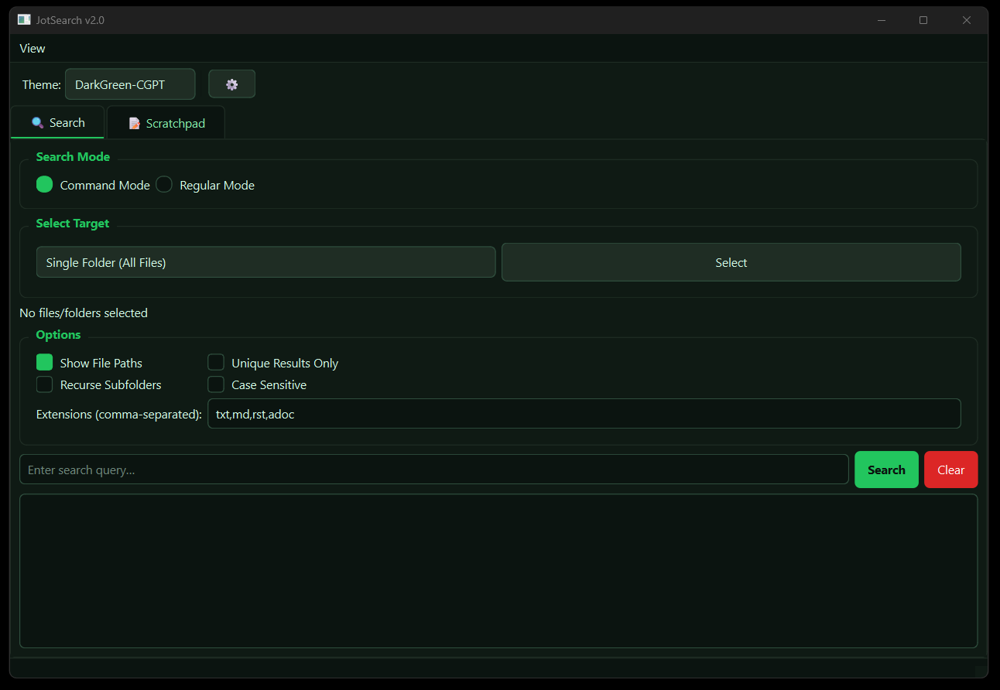

# 🧠 JotSearch v2.0 (PySide6 Edition)

A modern, tabbed desktop search utility built in **Python (PySide6)** that integrates **Ripgrep (rg)** for ultra-fast file content searches.  
Designed with a professional, dark-themed UI, multi-folder support, and an integrated scratchpad for quick note-taking.
---


## v2.0 — Feature Release

### New Features

#### 1. Theme Switcher
- Themes are defined in `config/themes.qss` using `/*Theme: Name*/` … `/*Theme End*/` block markers
- Theme names are auto-discovered at startup — no hardcoding required
- A **theme dropdown** is embedded directly in the top toolbar for instant one-click switching
- A **View menu** in the menu bar lists all themes as clickable actions (keyboard-navigable)
- Both controls stay in sync; selected theme persists across sessions via `settings.json`
- Shipped with two polished themes out of the box: **Dark** (Catppuccin Mocha palette) and **Light** (Catppuccin Latte palette), replacing the previous primitive inline stylesheet
- All UI elements — buttons, inputs, checkboxes, tree, scrollbars, tabs, dialogs — are fully styled in both themes, including the previously colorless Select button

#### 2. Settings Popup
- Accessible via the **⚙ gear button** on the top toolbar
- Settings are stored in `config/settings.json` and loaded on startup
- Configurable options:
  - **Default search mode** — which mode to open with
  - **Remember last mode** — optionally restore the last-used mode instead of the default
  - **Extension profiles** — named sets of file extensions (e.g. `default`, `web`, `docs`, `python`, `data`), editable as JSON; active profile is selectable from a dropdown
  - **Scratchpad directory** — default folder for open/save dialogs; falls back to the script folder if unset
  - **Autosave mode** — `Timed` (fires after a configurable interval of inactivity) or `On Change` (saves immediately on every edit)
  - **Autosave interval** — configurable in seconds (1–300)

#### 3. Save As — Format Restricted to md / txt
- Save As dialog now filters to **Markdown (*.md)** and **Text Files (*.txt)** only
- If no extension is provided, `.md` is appended automatically
- Open dialog also accepts these formats with proper filters

#### 4. Search Modes
- A **Search Mode** selector with two radio buttons appears above the target picker:
  - **Command Mode** — uses ripgrep in regex mode, matching the query *anywhere on the line* (e.g. searching `docker` returns lines like `wsl -d docker-desktop` and `docker run ...`). Supports regex patterns for power users.
  - **Regular Mode** — uses ripgrep's `--fixed-strings` flag for exact literal text matching across all content including comments and prose
- Active mode is shown in the status bar after each search (e.g. `[Command mode] Search done at 14:32:01 — 12 result(s)`)

#### 5. Syntax Highlighting in Scratchpad
- Powered by **Pygments** with a custom `QSyntaxHighlighter` bridge
- A **Language dropdown** in the scratchpad toolbar lets the user select from 25 languages: Markdown, Python, JavaScript, TypeScript, HTML, CSS, JSON, YAML, XML, Bash/Shell, SQL, C, C++, C#, Java, Rust, Go, Ruby, PHP, Kotlin, Swift, R, TOML, Dockerfile, and Plain Text
- **Auto-detection on file open** — language is set from the file extension (30+ extensions mapped); unknown extensions leave the current selection unchanged
- **User override** — the dropdown can be changed at any time and highlighting updates immediately; auto-detect only fires on open, never while editing
- Graceful fallback if Pygments is not installed — app runs normally without highlighting

#### 6. Multi-folder File Tree Picker
- Opening in **Multiple Folders** mode now launches a **floating folder tree dialog** instead of the broken repeated single-folder picker
- Features a **Browse Root** button to navigate to any starting directory
- Tree is populated 3 levels deep, hidden folders (dot-prefixed) are excluded
- **Tristate checkbox propagation**: checking a parent checks all descendants; unchecking reverses it; checking some children sets the parent to partial (indeterminate) state — propagation walks correctly up to all ancestor levels without cross-contaminating sibling branches
- OK confirms the selection; selected folder count is shown in the status bar

#### 7. themes.qss — Polished Dual-Theme Stylesheet
- `config/themes.qss` ships with complete **Dark** and **Light** themes
- Every widget class is explicitly styled: `QMainWindow`, `QMenuBar`, `QMenu`, `QTabBar`, `QGroupBox`, `QTextEdit`, `QLineEdit`, `QComboBox`, `QCheckBox`, `QRadioButton`, `QPushButton` (with per-button color via `#objectName`), `QToolButton`, `QScrollBar`, `QTreeWidget`, `QHeaderView`, `QSpinBox`, `QStatusBar`, `QDialog`, `QDialogButtonBox`
- Button colors use semantic assignments: Search = blue, Clear = red, New = green, Open = blue, Save = amber, Save As = orange
- Adding new themes requires only a new `/*Theme: Name*/` … `/*Theme End*/` block — the app picks them up automatically on next launch

## Known Bugs
- View and Theme dropdown redundant. Need to be removed. No Time
---

## v1.0 — Initial Release

- Single/multiple file and folder search using ripgrep (auto-downloaded if not found)
- Search options: show paths, unique results, recurse subfolders, case sensitivity, custom extensions
- Scratchpad with New / Open / Save / Save As and basic timed autosave
- Inline dark/light theme toggle (single button, hardcoded stylesheet)

## ✨ Features V1.0
# JotSearch Changelog
---
### 🔍 **Search Tab**
- **Modes:**
  - Single File
  - Multiple Files
  - Single Folder
  - Multiple Folders
- **Options:**
  - Show/Hide File Paths
  - Filter Unique Commands
  - Recurse Subfolders (configurable per mode)
  - Case Sensitivity Toggle
  - Extension filter (`txt,md,py,js,html,css` by default)
- **Results Display:**
  - Clean format:  
    ```
    file_path:line:result
    ```
  - Optional hiding of file paths.
  - Commands always shown on new lines.
- **Controls:**
  - Press **Enter** to start a search.
  - **Clear** button to reset results.
  - Real-time display of selected folders/files.
---

### ✍️ **Scratchpad Tab**
- Lightweight text editor for notes or command snippets.
- Buttons:  
  🟢 `New` 🔵 `Open` 🟡 `Save` 🟠 `Save As`  
  ✅ `Autosave` (2s delay after last keystroke)
- Autosave feedback in the status bar.
---

### 🎨 **Appearance**
- **Dark Mode (default)** and **Light Mode** toggle.
- **BGYOR button palette** for visual clarity:
  | Action | Color | Hex |
  |--------|--------|------|
  | Search | Blue | `#3498db` |
  | New | Green | `#2ecc71` |
  | Save | Yellow | `#f1c40f` |
  | Save As | Orange | `#e67e22` |
  | Theme Toggle | Violet | `#9b59b6` |
  | Exit/Warnings | Red | `#e74c3c` |
---

## ⚙️ Installation

### **Requirements**
- Python ≥ 3.9
- Dependencies:
```bash
  pip install PySide6 requests
```  

Optional (for developers):
```bash
pip install pyinstaller
```

🚀 Running the App
Run directly:
```bash
python JotSearch.py
```
Or create a packaged executable (Windows example):
```bash
pyinstaller --noconsole --onefile JotSearch.py
```

⚡ Ripgrep Integration
About Ripgrep
JotSearch uses Ripgrep (rg) — a blazing-fast text search engine written in Rust.
If Ripgrep is not installed, JotSearch will automatically download a portable binary suitable for your OS.

Where it’s stored
Downloaded binaries are saved in:
<app_folder>/bin/rg(.exe)

Manual Setup (optional)
If automatic installation fails, you can manually install rg:

Windows
Download the ZIP from:
https://github.com/BurntSushi/ripgrep/releases/latest
Extract rg.exe to:
JotSearch/bin/

macOS / Linux
Use your package manager:
brew install ripgrep
# or
sudo apt install ripgrep

📄 License Information
JotSearch License (MIT)
MIT License

Ripgrep License (MIT / Unlicense)
Ripgrep is developed by Andrew Gallant and licensed under either:

The MIT License, or
The Unlicense (public domain).

For more details, visit:
https://github.com/BurntSushi/ripgrep

📁 Project Structure
JotSearch/
├── JotSearch.py           # Main PySide6 GUI
├── README.md              # Documentation (this file)
├── screenshots/screenshot.png
├── scratchpad/custom files
├── bin/
│   └── rg(.exe)           # Ripgrep binary (auto-downloaded)
└── requirements.txt       # Optional dependency list

🧪 Debug & Development
To enable debug printouts (for testing):
Add print() statements in key methods: run_search, autosave_now, pick_target.
All GUI updates are safe to trigger from within main thread (Qt event loop safe).

🧰 Credits
Ripgrep by Andrew Gallant (BurntSushi)
PySide6 by The Qt Company
Concept & development: drem666

“Fast. Focused. Functional. — JotSearch brings Ripgrep power into a beautiful desktop interface.”